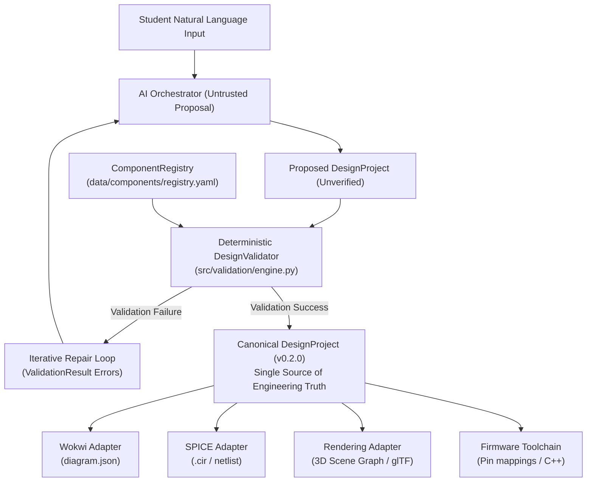

# ADR 003: Canonical Design IR as Single Source of Engineering Truth

## Status
Accepted

## Context
The Engineering Visualization Engine operates across multiple heterogeneous domains and subsystems:
- Student-facing natural language interfaces
- AI orchestration and proposal pipelines
- External electrical and firmware simulators (e.g., Wokwi JSON, SPICE netlists, Verilator harnesses)
- 2D schematic and 3D breadboard visualization scene graphs (e.g., Three.js, glTF, SVG)
- Deterministic Design Rule Checks (DRC) and Electrical Rule Checks (ERC)

Each subsystem requires a structured representation of the circuit. In distributed engineering systems, permitting each tool or subsystem to maintain its own native representation or attempting bidirectional state translation between multiple external formats creates severe risks:
1. **State Fragmentation & Synchronization Bugs:** Round-tripping between simulator-specific formats (e.g., Wokwi `diagram.json`) and schematic renderers is lossy and causes drift.
2. **Untrusted AI Overwrites:** Language models generate probabilistic, hallucination-prone output that cannot be allowed to directly mutate verified engineering state.
3. **Stale Validation Results:** Coupling validation outcomes directly inside the persisted circuit state risks stale status flags, or allows an AI proposal to spoof a "passed" validation status.

Without an unambiguous canonical model, the system lacks a single source of engineering truth.

## Decision
We establish the [`DesignProject`](file:///Y:/illus-d1/illustration-engine/src/core/models.py#L82-L92) Pydantic model (`src/core/models.py`) as the **CANONICAL** state for any engineering design within the platform. All other representations, simulator formats, rendering structures, and code assets are strictly derived from it.

### Key Architectural Tenets

#### 1. Why the Design IR is Canonical
The Design IR ([`DesignProject`](file:///Y:/illus-d1/illustration-engine/src/core/models.py#L82-L92)) is the single source of truth (SSOT) consumed and produced by all engine tooling:
- It models core domain semantics: discrete component instances ([`ComponentInstance`](file:///Y:/illus-d1/illustration-engine/src/core/models.py#L50-L56)), pin-level net topologies ([`Net`](file:///Y:/illus-d1/illustration-engine/src/core/models.py#L72-L76), [`PinRef`](file:///Y:/illus-d1/illustration-engine/src/core/models.py#L57-L70)), user/AI-configured parameters, curriculum alignment ([`CurriculumContext`](file:///Y:/illus-d1/illustration-engine/src/core/models.py#L13-L17)), and simulation targets ([`SimulationMetadata`](file:///Y:/illus-d1/illustration-engine/src/core/models.py#L77-L81)).
- It is strictly vendor-neutral, simulator-agnostic, and renderer-agnostic.
- Changes to engineering designs occur only through operations on the canonical `DesignProject`. No subsystem is permitted to store authoritative domain state outside of this schema.

#### 2. Why External Simulator Formats are Adapters
External simulation and tool formats (e.g., Wokwi JSON, SPICE netlists, KiCad files, Verilog testbenches) are derived downstream projections:
- All external formats are generated via **unidirectional adapters** that read a canonical [`DesignProject`](file:///Y:/illus-d1/illustration-engine/src/core/models.py#L82-L92) and emit simulator-specific payloads.
- Adapters never work in reverse to update canonical state. External formats are ephemeral and can be regenerated on demand.
- Domain rules, pin naming, and net topology reside in the IR, insulating the core architecture from simulator idiosyncrasies.

#### 3. Why AI Provider Output is Not Canonical
LLM providers generate probabilistic suggestions, not verified engineering data:
- The AI proposes a `DesignProject` structure based on student input and retrieval contexts.
- This output is classified as an **untrusted proposal**. It has zero authority until it successfully passes through the deterministic [`DesignValidator`](file:///Y:/illus-d1/illustration-engine/src/validation/engine.py#L5-L40).
- If validation fails, the proposal is rejected. The errors from the validator are piped back to the AI for automated repair, preventing unverified or broken circuits from entering the canonical store.

#### 4. Why Validation Results are Derived State
The [`ValidationResult`](file:///Y:/illus-d1/illustration-engine/src/core/models.py#L102-L108) is computed dynamically by the [`DesignValidator`](file:///Y:/illus-d1/illustration-engine/src/validation/engine.py#L5-L40) as a pure function of the design state and the component definitions:
$$\text{ValidationResult} = f(\text{DesignProject}, \text{ComponentRegistry})$$
- `ValidationResult` is **deliberately NOT stored** inside [`DesignProject`](file:///Y:/illus-d1/illustration-engine/src/core/models.py#L82-L92).
- Storing validation results inside the project schema would create stale state when component definitions or rules change, and would allow an untrusted AI proposal to assert `{"status": "PASS"}` without running the validator.
- Keeping validation as external derived state ensures validation is always fresh, reproducible, and verifiable.
- **Validation limits:** Validation is strictly limited by the electrical metadata in the Component Registry. If metadata (like `max_voltage`) is missing, the validator returns a `NOT_CHECKABLE` warning rather than silently passing, ensuring false positives are prevented.

## Consequences

### Positive
- **Single Point of Verification:** Any design, whether generated by AI or loaded from disk, passes through identical deterministic validation logic.
- **Modularity:** Adding support for a new simulator (e.g., Falstad, ngspice, Verilator) or renderer (e.g., Three.js, KiCad SVG) requires implementing only a single outbound adapter from [`DesignProject`](file:///Y:/illus-d1/illustration-engine/src/core/models.py#L82-L92).
- **Zero Validation Drift:** Validation can be re-run at any time without side effects, data mutation, or cache invalidation complexities.
- **Pydantic v2 Strong Typing:** High-performance validation, serialization, and JSON schema export are guaranteed across all platform interfaces.

### Negative / Trade-offs
- **Adapter Maintenance:** Each supported simulator requires maintaining an explicit transformation layer from the Canonical Design IR.
- **Simulator-Specific Features:** Advanced, simulator-specific directives (e.g., SPICE `.tran` commands or custom Wokwi attributes) cannot pollute core fields and must be stored in the generic `metadata` or `simulation.parameters` dictionaries.
