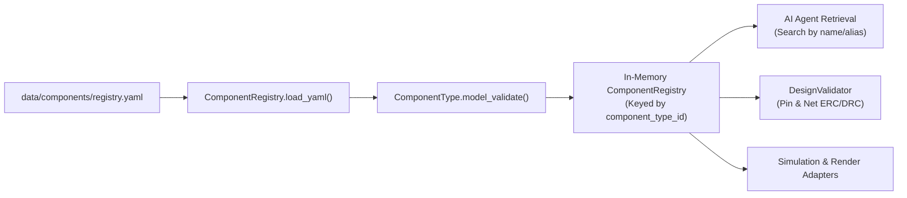

# Component Registry Specification

**Implementation Source:** [`src/components/registry.py`](file:///Y:/illus-d1/illustration-engine/src/components/registry.py)  
**Schema Models:** [`src/core/models.py`](file:///Y:/illus-d1/illustration-engine/src/core/models.py)  
**Default Registry Data:** [`data/components/registry.yaml`](file:///Y:/illus-d1/illustration-engine/data/components/registry.yaml)

---

## 1. Overview & Architecture

The **Component Registry** acts as the authoritative dictionary for all physical components, circuit primitives, and virtual routing nodes within the platform. It defines the allowed parts catalog, specifying pin configurations, electrical ratings, allowable configurable parameters, and behavioral constraints.

The registry enforces the platform's core architectural principle: **"No Silent Inventions"**.
- AI agents cannot invent imaginary components or arbitrary pinouts; all proposed designs must map directly to registered canonical component identifiers.
- Deterministic validators ([`DesignValidator`](file:///Y:/illus-d1/illustration-engine/src/validation/engine.py#L5-L40)) rely on the registry to perform Electrical Rule Checks (ERC) and Design Rule Checks (DRC).



---

## 2. Component Data Models

The registry data structures are defined using Pydantic v2 in [`src/core/models.py`](file:///Y:/illus-d1/illustration-engine/src/core/models.py).

### 2.1 [`ComponentType`](file:///Y:/illus-d1/illustration-engine/src/core/models.py#L25-L43)
Defines an engineering entity type that can be instantiated in a design.

| Field | Type | Default | Description |
| :--- | :--- | :--- | :--- |
| `component_type_id` | `str` | *Required* | Canonical unique identifier formatted with a category prefix (e.g., `"board:esp32-devkit-v1"`). |
| `name` | `str` | *Required* | Human-readable name (e.g., `"ESP32-DevKitC V1"`). |
| `aliases` | `List[str]` | `[]` | Common student/search terms (e.g., `["esp32", "esp32-devkit"]`). |
| `category` | [`ComponentCategory`](file:///Y:/illus-d1/illustration-engine/src/core/enums.py#L16-L24) | *Required* | Functional classification enum. |
| `object_type` | [`ObjectType`](file:///Y:/illus-d1/illustration-engine/src/core/enums.py#L36-L44) | *Required* | Domain model object classification. |
| `pins` | `List[PinDefinition]` | `[]` | List of pins/ports on the component. |
| `electrical_properties` | `Dict[str, str]` | `{}` | Inherent electrical properties (e.g., `operating_voltage`, `power_rating`). |
| `configurable_parameters` | `Dict[str, str]` | `{}` | Parameters configurable at instance time (e.g., `resistance: "ohm"`, `color: "enum"`). |
| `curriculum_mapping` | `List[str]` | `[]` | Curriculum concepts supported by this component. |
| `competency_level` | [`CompetencyLevel`](file:///Y:/illus-d1/illustration-engine/src/core/enums.py#L3-L6) | `BEGINNER` | Target student competency level (`BEGINNER`, `INTERMEDIATE`, `ADVANCED`). |
| `provenance` | `str` | `"community"` | Origin/source of the component definition. |
| `license` | `str` | `"unknown"` | License of the component definition. |
| `asset_2d` | `Optional[str]` | `None` | Path or reference to 2D schematic symbol asset. |
| `asset_3d` | `Optional[str]` | `None` | Path or reference to 3D GLB/glTF model asset. |
| `simulation_model` | `Optional[str]` | `None` | Reference to simulation SPICE model or Wokwi definition. |
| `description` | `str` | `""` | Detailed description of the component. |
| `validation_status` | `str` | `"proposed"` | Current registry status (e.g., `"proposed"`, `"verified"`). |

### 2.2 [`PinDefinition`](file:///Y:/illus-d1/illustration-engine/src/core/models.py#L18-L23)
Defines an electrical or logical terminal on a component.

| Field | Type | Default | Description |
| :--- | :--- | :--- | :--- |
| `pin_id` | `str` | *Required* | Identifier for the pin (e.g., `"GPIO5"`, `"VCC"`, `"ANODE"`, `"PIN1"`). |
| `name` | `str` | *Required* | Human-readable pin name. |
| `direction` | [`PinDirection`](file:///Y:/illus-d1/illustration-engine/src/core/enums.py#L8-L14) | *Required* | Electrical direction: `INPUT`, `OUTPUT`, `BIDIRECTIONAL`, `POWER`, `GROUND`, or `PASSIVE`. |
| `electrical_type` | `Optional[str]` | `None` | Voltage or logic level specification (e.g., `"3.3V_LOGIC"`, `"5V"`, `"5V_TOLERANT"`). |
| `max_voltage` | `Optional[float]` | `None` | Maximum voltage this pin can tolerate (input) or output (output). |
| `min_voltage` | `Optional[float]` | `None` | Minimum voltage this pin can output (output) or requires for logic-high (input). |
| `description` | `str` | `""` | Functional description of the pin. |

---

## 3. YAML File Format & Loading Mechanism

### 3.1 YAML Storage Format
Component types are defined in human-readable YAML files (primarily [`data/components/registry.yaml`](file:///Y:/illus-d1/illustration-engine/data/components/registry.yaml)). The file structure organizes components under a top-level `components` dictionary, where each key represents the canonical `component_type_id`:

```yaml
components:
  "board:esp32-devkit-v1":
    name: "ESP32-DevKitC V1"
    aliases: ["esp32", "esp32-devkit"]
    category: MICROCONTROLLER
    object_type: PHYSICAL
    description: "ESP32-DevKitC V1 (30-pin) development board"
    pins:
      - pin_id: "VIN"
        name: "VIN"
        direction: POWER
        electrical_type: "5V"
      - pin_id: "GND1"
        name: "GND1"
        direction: GROUND
    electrical_properties:
      operating_voltage: "3.3V"
    configurable_parameters: {}
```

### 3.2 Loading Pipeline in [`ComponentRegistry`](file:///Y:/illus-d1/illustration-engine/src/components/registry.py#L15-L96)
The loading mechanism handles file I/O, ID injection, and schema validation:

1. **Path Resolution:** Resolves registry file paths relative to the project root.
2. **Safe Parsing:** Uses `yaml.safe_load(f)` to deserialize the file.
3. **ID Injection:** Extracts each dictionary key (e.g., `"board:esp32-devkit-v1"`) and sets `comp_props["component_type_id"] = comp_id`.
4. **Pydantic Validation:** Instantiates and validates each entry via `ComponentType.model_validate(comp_props)`.
5. **Fault-Tolerant Storage:** Invalid component entries trigger a logged warning without terminating execution, allowing remaining valid parts to load.
6. **Lookup Population:** Valid instances are indexed into internal dictionary `self._types[comp_id]`.

### 3.3 Registry API
The [`ComponentRegistry`](file:///Y:/illus-d1/illustration-engine/src/components/registry.py#L15-L96) exposes query and introspection methods:

- **`load_yaml(path: Path) -> int`:** Loads components from a YAML path; returns count of successfully loaded components.
- **`get(component_type_id: str) -> Optional[ComponentType]`:** Fetches a component by its exact canonical ID. Returns `None` if not registered.
- **`has(component_type_id: str) -> bool`:** Fast boolean membership check.
- **`search(query: str) -> list[ComponentType]`:** Case-insensitive substring search matching against `component_type_id`, `name`, and elements of `aliases`.
- **`list_all() -> list[ComponentType]`:** Returns all registered component types.
- **`count` (property):** Total count of registered components.
- **`get_default_registry() -> ComponentRegistry`:** Factory function that loads the standard registry from `data/components/registry.yaml`.

---

## 4. Registered Components

The default registry contains **8 foundational components** supporting the Phase-1 Vertical Slice (Smart Parking System) and core circuit fundamentals:

### 1. `board:esp32-devkit-v1`
- **Name:** ESP32-DevKitC V1
- **Category:** `ComponentCategory.MICROCONTROLLER`
- **Object Type:** `ObjectType.PHYSICAL`
- **Aliases:** `["esp32", "esp32-devkit"]`
- **Description:** 30-pin ESP32 development board with WiFi and BLE.
- **Pins (30 total):**
  - `VIN` (POWER, 5V input)
  - `3V3` (POWER, 3.3V output)
  - `GND1`, `GND2`, `GND3` (GROUND)
  - `EN` (INPUT, active-high enable)
  - 25 GPIO pins (BIDIRECTIONAL, `3.3V_LOGIC`): `GPIO2`, `GPIO4`, `GPIO5`, `GPIO12`, `GPIO13`, `GPIO14`, `GPIO15`, `GPIO16`, `GPIO17`, `GPIO18`, `GPIO19`, `GPIO21`, `GPIO22`, `GPIO23`, `GPIO25`, `GPIO26`, `GPIO27`, `GPIO32`, `GPIO33`.
- **Electrical Properties:**
  - `operating_voltage`: 3.3V
  - `input_voltage_max`: 12V
  - `gpio_max_current`: 40mA
  - `wifi`: 802.11 b/g/n
  - `bluetooth`: BLE 4.2

---

### 2. `sensor:hc-sr04`
- **Name:** HC-SR04 Ultrasonic Distance Sensor
- **Category:** `ComponentCategory.SENSOR`
- **Object Type:** `ObjectType.PHYSICAL`
- **Aliases:** `["hc-sr04", "ultrasonic"]`
- **Description:** Ultrasonic range detection module.
- **Pins (4 total):**
  - `VCC` (POWER, 5V input)
  - `TRIG` (INPUT, `5V_TOLERANT` trigger pulse input)
  - `ECHO` (OUTPUT, 5V logic pulse return)
  - `GND` (GROUND)
- **Electrical Properties:**
  - `operating_voltage`: 5V
  - `measuring_range`: 2cm–400cm
  - `trigger_pulse`: 10us
- **Design Note:** The ECHO pin outputs 5V logic. Direct connection to 3.3V microcontrollers (e.g., ESP32) is flagged as an engineering concern requiring a voltage divider in production designs.

---

### 3. `passive:led-5mm`
- **Name:** Generic 5mm LED
- **Category:** `ComponentCategory.PASSIVE_COMPONENT`
- **Object Type:** `ObjectType.PHYSICAL`
- **Aliases:** `["led", "5mm-led"]`
- **Description:** Generic 5mm through-hole light emitting diode.
- **Pins (2 total):**
  - `ANODE` (PASSIVE, positive anode terminal)
  - `CATHODE` (PASSIVE, negative cathode terminal)
- **Electrical Properties:**
  - `forward_voltage_typical`: 2.0V
  - `forward_voltage_max`: 2.4V
  - `max_forward_current`: 20mA
  - `recommended_current`: 10mA
- **Configurable Parameters:**
  - `color`: enum (e.g., `"red"`, `"green"`, `"blue"`, `"yellow"`)

---

### 4. `passive:resistor-tht`
- **Name:** Generic Resistor THT
- **Category:** `ComponentCategory.PASSIVE_COMPONENT`
- **Object Type:** `ObjectType.PHYSICAL`
- **Aliases:** `["resistor"]`
- **Description:** Standard through-hole fixed resistor.
- **Pins (2 total):**
  - `PIN1` (PASSIVE)
  - `PIN2` (PASSIVE)
- **Electrical Properties:**
  - `power_rating`: 0.25W
- **Configurable Parameters:**
  - `resistance`: ohm value (e.g., `"330"`, `"10k"`, `"1M"`)

---

### 5. `passive:push-button-tactile`
- **Name:** Tactile Push Button
- **Category:** `ComponentCategory.PASSIVE_COMPONENT`
- **Object Type:** `ObjectType.PHYSICAL`
- **Aliases:** `["button", "push-button"]`
- **Description:** 4-pin tactile momentary pushbutton (internally connected pairs).
- **Pins (4 total):**
  - `PIN1A`, `PIN1B` (PASSIVE, mutually connected terminal 1 pair)
  - `PIN2A`, `PIN2B` (PASSIVE, mutually connected terminal 2 pair)
- **Electrical Properties:**
  - `max_voltage`: 12V
  - `max_current`: 50mA

---

### 6. `primitive:power-rail`
- **Name:** Power Rail
- **Category:** `ComponentCategory.POWER_SOURCE`
- **Object Type:** `ObjectType.CIRCUIT_PRIMITIVE`
- **Aliases:** `["power", "vcc"]`
- **Description:** Circuit primitive modeling a power supply rail (e.g., breadboard red power strip or external supply).
- **Pins (1 total):**
  - `VCC` (POWER)
- **Electrical Properties:**
  - `voltage`: 5V
- **Configurable Parameters:**
  - `voltage`: Voltage value (e.g., `"3.3"`, `"5"`, `"12"`)

---

### 7. `primitive:ground-rail`
- **Name:** Ground Rail
- **Category:** `ComponentCategory.GROUND_NODE`
- **Object Type:** `ObjectType.CIRCUIT_PRIMITIVE`
- **Aliases:** `["ground", "gnd"]`
- **Description:** Circuit primitive modeling a 0V common ground return node.
- **Pins (1 total):**
  - `GND` (GROUND)
- **Electrical Properties:** None (reference node)

---

### 8. `routing:jumper-wire`
- **Name:** Jumper Wire
- **Category:** `ComponentCategory.ROUTING`
- **Object Type:** `ObjectType.CIRCUIT_PRIMITIVE`
- **Aliases:** `["wire", "jumper"]`
- **Description:** Physical jumper wire used for breadboard routing.
- **Pins (2 total):**
  - `PIN1` (PASSIVE)
  - `PIN2` (PASSIVE)
- **Electrical Properties:** None (ideal short circuit)

---

## 5. Taxonomy & Classification Enums

The registry organizes components using two orthogonal categorization enums in [`src/core/enums.py`](file:///Y:/illus-d1/illustration-engine/src/core/enums.py):

### [`ComponentCategory`](file:///Y:/illus-d1/illustration-engine/src/core/enums.py#L16-L24)
Functional engineering role:
- `MICROCONTROLLER`: Programmable controllers (e.g., ESP32).
- `SENSOR`: Transducers reading physical state (e.g., HC-SR04).
- `PASSIVE_COMPONENT`: Resistors, capacitors, LEDs, buttons.
- `ACTIVE_COMPONENT`: Transistors, op-amps, discrete ICs.
- `CONNECTOR`: Terminal blocks, headers, USB connectors.
- `POWER_SOURCE`: Batteries, power rails, DC jacks.
- `GROUND_NODE`: Ground rails and 0V reference nodes.
- `ROUTING`: Jumper wires, breadboard bus strips.

### [`ObjectType`](file:///Y:/illus-d1/illustration-engine/src/core/enums.py#L36-L44)
Domain abstraction layer:
- `PHYSICAL`: Tangible parts with physical footprints and packaging.
- `CIRCUIT_PRIMITIVE`: Idealized schematic/electrical nodes (e.g., rails, wires).
- `DIGITAL_PRIMITIVE`: Logic gates, flip-flops.
- `RTL_OBJECT`: Synthesizable Verilog/VHDL modules.
- `SEMICONDUCTOR_PRIMITIVE`: Transistor layouts, FinFETs, doping regions.
- `VERIFICATION_OBJECT`: Testbenches, logic analyzers, probes.
- `VISUALIZATION_PRIMITIVE`: Virtual breadboards, cameras, labels.
- `PACKAGING_OBJECT`: IC packages, interposers, wirebonds.
